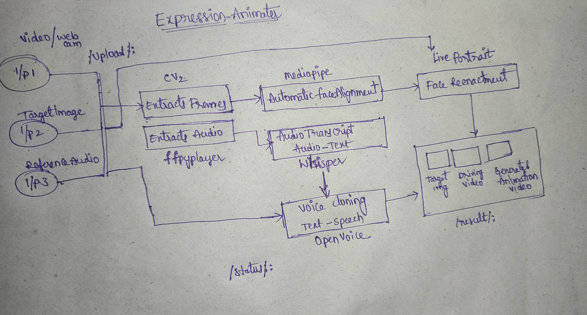

# Face Reenactment and Voice Cloning Pipeline

Explored the state of the art and real time modesl that delivers the effective and realistic animated videos with target image, driving video along with the users reference audio!



### Inputs
* Target Image – The reference image for facial reenactment
* Driving Video – The video that drives the animation.
* Reference Audio – The audio file to be cloned and synchronized.

**Environment Setup** 
General Requirements
* Jupyter Notebook Kernel: Python 3.10.11
* GPU: NVidia GPU with minimum 8 GB VRAM for face reenactment models (LivePortrait).
---

### Key Libraries:
Stage	Tool/Library	Purpose	Reference Notebook

| Stage   | Tool/Library     | Purpose                                                                                   | Reference Notebook                |
| ------- | ---------------- | ----------------------------------------------------------------------------------------- | --------------------------------- |
| Stage-1 | **MediaPipe**    | Face alignment using facial landmarks (eyes, lips) to align the face with head movements. | `mediapipe/facemesh-1.ipynb`      |
| Stage-1 | **Whisper**      | Audio-to-text transcription from the input audio file.                                    | `voice-text/whisper.ipynb`        |
| Stage-2 | **OpenVoice V1** | Multi-language voice cloning and text-to-speech generation.                               | `OpenVoice/demo_part1.ipynb`      |
| Stage-3 | **LivePortrait** | Face reenactment and animation generation using CUDA-enabled GPU.                         | `LivePortrait/LivePortrait.ipynb` |
---

 **How Each Stage Works** 

**Stage 1** : Face Alignment & Audio-Text Generation

MediaPipe: Extracts and aligns facial coordinates to adjust face orientation dynamically.
Whisper: Generates text transcript from the provided reference audio.

**Stage 2**: Voice Cloning using OpenVoice
Uses OpenVoice V1 model to convert generated transcripts into cloned speech with multilingual capabilities.

Refer outputs in the outputs folder for sample results.

**Stage 3**: Face Reenactment using LivePortrait
LivePortrait model is used to animate the target image based on driving video movements.

Note: Requires CUDA (NVidia GPU) for optimal performance. The current implementation utilizes Google Colab for GPU acceleration.

---
```
📁 Project Structure
.
├── LivePortrait/
│   ├── LivePortrait.ipynb
│   ├── testing1--exp_test_... (test output files)
├── mediapipe/
│   ├── models/
│   ├── test/
│   ├── MediaPipe_Python_... (misc file)
│   ├── facemesh-1.ipynb
│   └── requirements.txt
├── OpenVoice/
├── problemStatement/
│   └── ML Engineer Assignment.pdf
├── voice-text/
│   ├── audio.mp3
│   └── wisper.ipynb
└── README.md
```
---
### Challenges
* wishper only capable of python version < 3.11. so, for me it worked on pythton3.10.11
* Face Reenactment models such as Liveportrait,fsrt,FOMM necessarily require the GPU (compliled on colab)
* tried to build the FastAPI in colab but it fails due to dependency and environment set ups that varies for different frames(mediapipe, numpy<2.x), but for the torch and torchaudio dependencies it should be numpy>1.x.
* we need a good system that compatible to infere the these combined outputs.
* I have successfully complied and got the resutls for the given tasks.
---
### ⚠️ Notes
Ensure CUDA and cuDNN are configured properly for GPU tasks.

Whisper and MediaPipe stages run efficiently on CPU but GPU accelerates inference.

For production deployment, integrate all notebooks into modular scripts with a unified API endpoint.

Done by: praveensunkara19